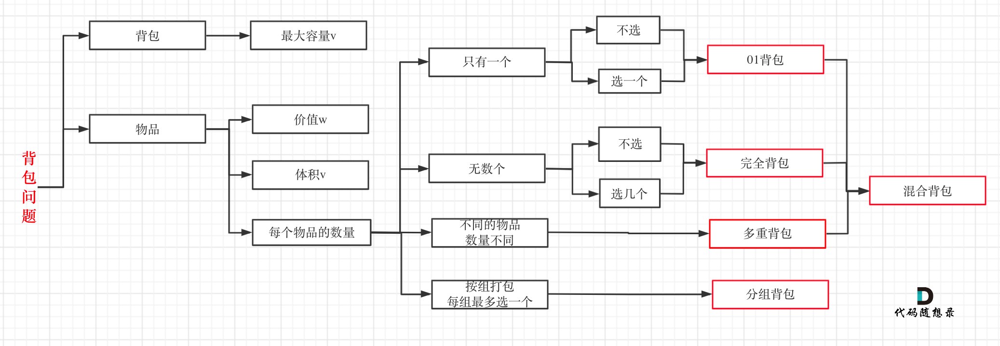

借用《代码随想录》的一张背包问题的分类图


# **0-1背包**
    有 N 件物品和一个最多能被重量为 W 的背包。
    第 i 件物品的重量是 weight[i]，得到的价值是 value[i]。
    每件物品只能用一次，求解将哪些物品装入背包里物品价值总和最大。

举个例子：背包最大重量为 4。物品为：

| 物品 | 重量 | 价值 |
| :---:| :---: | :---: |
| 物品 0 | 1 | 15 |
| 物品 1 | 3 | 20 |
| 物品 2 | 4 | 30 |
问背包能背的物品最大价值是多少？

## **一、暴力解法**
每一件物品其实只有两个状态，取或者不取，所以可以使用回溯法搜索出所有的情况，那么时间复杂度就是 O(2^n)，这里的 n 表示物品数量。

## **二、二维dp数组**

使用五部曲

### **1、确定dp数组以及下标的含义:**

dp[i][j]表示从下标为 [0~i] 的物品里任意取，放进容量为 j 的背包里的价值总和最大值

### **2、确定递推公式**

dp[i][j]的取值有两种情况:

不放物品 i :从dp[i-1][j]推出，即背包容量为 j，在不放物品 i 的最大价值。dp[i][j] = dp[i-1][j]

放物品 i :首先先要确保当前背包可以放进物品 i ，若当前背包不能放进物品 i，则坍缩为不放物品 i 的情况；
若当前背包可以放进物品 i (即 j - weight[i] > 0),则当前的最大的价值为恰好放进物品 i 时的最大价值 (dp[i-1][j-weight[i]]) + 物品 i 的价值 (value[i])，即dp[i][j] = dp[i-1][j-weight[i]] + value[i]

综上：

if (j < weight[i])
dp[i][j] = dp[i-1][j];

else dp[i][j] = max(dp[i-1][j], dp[i-1][j - weight[i]] + value[i]);

### **3、dp数组如何初始化**

初始化时要与 dp 数组的定义相符合。

从递推公式来看，i 是从 i - 1 推广出来的，所以必须把 i == 0 时的情况初始化
当 i == 0 时（即只有物品 0 时）:

当背包可以放进物品 0 时(j >= weight[0])，dp[0][j] = value[0];

当背包放不进物品 0 时(j < weight[0])，dp[0][j] = 0;

此外，数组中其他数据在遍历中会被重新辅助，所以赋值为啥都可以，所以全部赋值为0；
另外，当 j == 0 时（即背包容量为 0 时），dp[i][0] = 0；


### **4、确定遍历顺序**
dp[i][j] = max(dp[i-1][j], dp[i-1][j - weight[i]] + value[i])

因为dp数组为二维数组，按照 dp[i][j] 与 dp[i-1][j] 和 dp[i-1][j - weight[i]] 有关，且两种来源数据不冲突，所以先遍历物品或先遍历背包均可,从前往后、从后往前均可。

### **5、举例推导dp数组**


| i \ j| 0 | 1 | 2 | 3 | 4 |
| :---:| :---: | :---: | :---: | :---: | :---: |
| 物品 0 | 0 | 15 | 15 | 15 | 15 |
| 物品 1 | 0 | 15 | 20 | 20 | 35 |
| 物品 2 | 0 | 15 | 15 | 20 | **_35_** |

最终结果为：dp[2][4] == 35

### **6、C语言代码**
[backpack_01_two_dimensional_array.c](./backpack_01_two_dimensional_array.c)

````
#include <stdio.h>
#include <string.h>

int weight[] = {1, 3, 4};// 物品重量
int value[] = {15, 20, 30};// 物品价值
int bagWeight = 4;// 背包容量

#define MAX(x, y) (x) > (y) ? (x) : (y);

void test_2_wei_bag_problem() {

    int num_of_goods = sizeof(weight) / sizeof(int);

    int dp[num_of_goods][bagWeight + 1];// 二维数组

    // 初始化
    memset(dp, 0, sizeof(dp));
    for (int j = weight[0]; j <= bagWeight; j++) {
        dp[0][j] = value[0];
    }

    // weight数组的大小 就是物品个数
    for (int i = 1; i < num_of_goods; i++) { // 遍历物品
        for (int j = 0; j <= bagWeight; j++) { // 遍历背包容量
            if (j < weight[i]) dp[i][j] = dp[i - 1][j];
            else dp[i][j] = MAX(dp[i - 1][j], dp[i - 1][j - weight[i]] + value[i]);
        }
    }
    printf("最大价值为:%d\n", dp[num_of_goods - 1][bagWeight]);
}

int main() {
    test_2_wei_bag_problem();
}

````

## **三、一维滚动数组**

在使用二维数组的时候，递推公式：dp[i][j] = max(dp[i-1][j], dp[i-1][j - weight[i]] + value[i]);

dp[i] 是通过 dp[i-1] 来得到的，所以我们在得到 dp[i-1] 后 dp[i] 就没有用了。所以可以将二维数组坍缩为一维数组。

即：dp[ i ][ j ] = max(dp[ i ][ j ], dp[ i ][ j - weight[ i ] ] + value[ i ]);

这就是滚动数组的由来，**_需要满足的条件是上一层可以重复利用，直接拷贝到当前层_**。

使用五部曲

### **1、确定dp数组的定义**

dp[j] 表示容量为 j 的背包，所背的物品价值最大为dp[j];

### **2、确定递推公式**

不放物品 i :从dp[j]推出，即背包容量为 j，在不放物品 i 的最大价值。dp[j] = dp[j];（我就是我，颜色不一样的花火！）

放物品 i :首先先要确保当前背包可以放进物品 i ，若当前背包不能放进物品 i，则坍缩为不放物品 i 的情况；
若当前背包可以放进物品 i (即 j - weight[i] > 0),则当前的最大的价值为恰好放进物品 i 时的最大价值 (dp[j-weight[i]]) + 物品 i 的价值 (value[i])，即dp[j] = dp[j-weight[i]] + value[i];

综上：

if (j < weight[i])
dp[j] = dp[j];

else dp[j] = max(dp[j], dp[j - weight[i]] + value[i]);

### **3、dp数组如何初始化**

初始化时要与 dp 数组的定义相符合。

dp[j] 是从 dp[j-value[i]] 推出

当 j == 0 时（即背包容量为 0 时），dp[0] = 0；

其他数据会在遍历中背重新赋值，所以赋值为啥都行，所以赋值为0；

### **4、确定遍历顺序**

一维数组遍历顺序不是 从前到后 就是 从后到前，

如果从前到后：(以装物品 0 为例)

dp[1] = dp[1 - weight[0]] + value[0] = 15

dp[2] = dp[2 - weight[0]] + value[0] = 30

意味着在容量为2时，物品 0 被放了两次，不符合实际。

如果从后到前：(以装物品 0 为例)

dp[2] = dp[2 - weight[0]] + value[0] = 15

dp[1] = dp[1 - weight[0]] + value[0] = 15

所以从后往前循环，每次取得状态不会和之前取得状态重合，这样每种物品就只取一次了。

### **5、举例推导dp数组**

遍历物品 0 遍历背包时 

| 0 | 15 | 15 | 15 | 15 |
| :---: | :---: | :---: | :---: | :---: |

遍历物品 1 遍历背包时

| 0 | 15 | 15 | 20 | 35 |
| :---: | :---: | :---: | :---: | :---: |

遍历物品 2 遍历背包时

| 0 | 15 | 15 | 20 | **_35_** |
| :---: | :---: | :---: | :---: | :---: |

最终结果为:**_35_**

### **6、C语言代码**
[backpack_01_one_dimensional_array.c](./backpack_01_one_dimensional_array.c)

````
#include <stdio.h>
#include <string.h>

int weight[] = {1, 3, 4};// 物品重量
int value[] = {15, 20, 30};// 物品价值
int bagWeight = 4;// 背包容量

#define MAX(x, y) (x) > (y) ? (x) : (y);

void test_1_wei_bag_problem() {

    int num_of_goods = sizeof(weight) / sizeof(int);

    int dp[bagWeight + 1];// 二维数组

    // 初始化
    memset(dp, 0, sizeof(dp));

    for (int i = 0; i < num_of_goods; i++) { // 遍历物品,从物品 0 开始
        for (int j = bagWeight; j >= weight[i]; j--) { // 遍历背包容量，从后往前
            dp[j] = MAX(dp[j], dp[j - weight[i]] + value[i]);
        }
    }
    printf("最大价值为:%d\n", dp[bagWeight]);
}

int main() {
    test_1_wei_bag_problem();
}

````